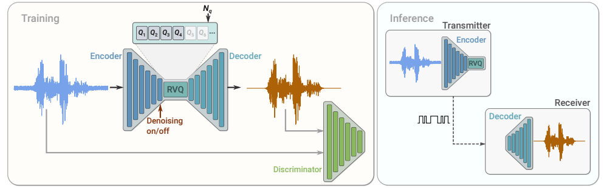

# SoundStream: An End-to-End Neural Audio Codec

This repository is an implementation of the [article](https://arxiv.org/abs/2107.03312) with same name.

<p align="center">

</p>

The _RVQ_ (stands for Residual Vector Quantizer) relies on __lucidrains__' [repository](https://github.com/lucidrains/vector-quantize-pytorch).

I built this implementation to serve my needs and some features are missing from the original article.

## Missing pieces

- [ ] __Denoising__: this implementation is not built to denoise, so there is no conditioning signal nor _Feature-wise Linear Modulation_ blocks.
- [ ] __Bitrate scalability__: for now, quantizer dropout has not been implemented.

## Citations

```bibtex
@misc{zeghidour2021soundstream,
    title   = {SoundStream: An End-to-End Neural Audio Codec},
    author  = {Neil Zeghidour and Alejandro Luebs and Ahmed Omran and Jan Skoglund and Marco Tagliasacchi},
    year    = {2021},
    eprint  = {2107.03312},
    archivePrefix = {arXiv},
    primaryClass = {cs.SD}
}
```